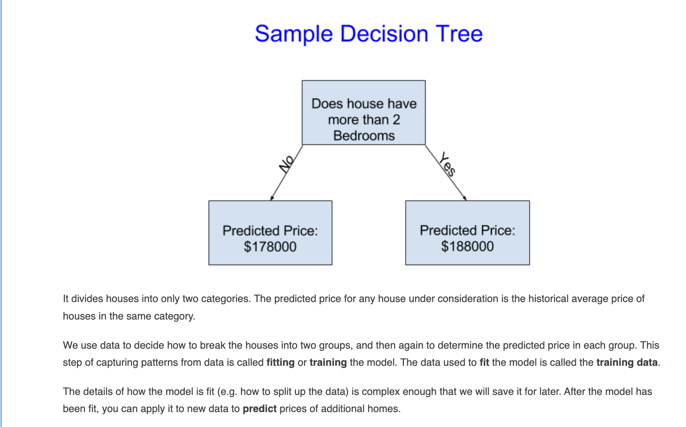
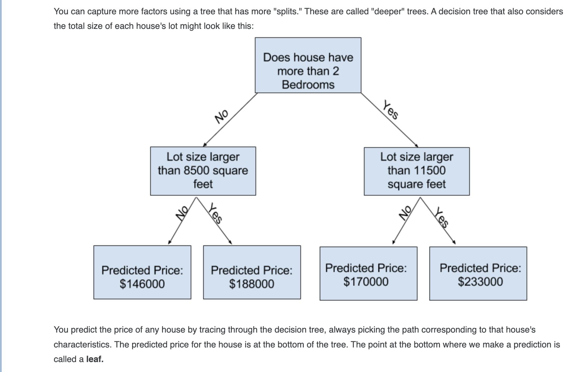
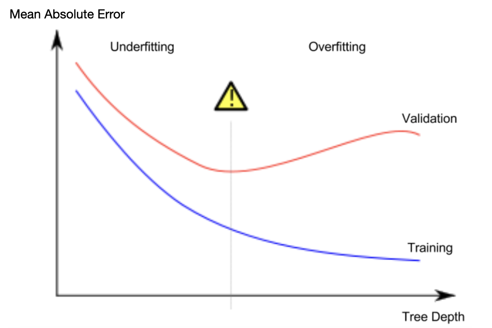

# Introduction To Machine Learning:(The training process)
Machine Learning is the science of training and teaching computer from data to make it understand
patterns for decisin making.
# A Model:(The Final product)
A model is a resulting brain that we get from that training process.

Machine Learning is the process of teaching computer that results in a model,
think of like you are a Data Scientist hired at real_estate company , they are asking you to predict
house prices so that they can make better investments.
Before starting out you will ask them question how they are predicting prices before , you get to hear that 
they are making assumbtions based on their previous work and factors like size , region . You analyse that
the they are working with patterns from houses from past.
Machine Learning works the same way, we will start with a model called DecisionTreeRegressor.

In this screenshot we have simple working pricipal of DecisionTreeRegressor,
and concepts like model fit , training and prdeict.

This screenshot shows "deeper tress".

# 1.Basic Data Exploration
we will see this first part in our notebook's first part
[text](notebook/property.ipynb)

# 2.Your First Machine Learning Model
**Selecting Data for Modeling**
1.Dot notation, which we use to select the "prediction target"
2.Selecting with a column list, which we use to select the "features"
**Selecting The Prediction Target**
**Choosing "Features"**

**Building Your Model**
we will use sckitlearn library to create our model. 
there are 4 steps for building and using model are:
1.Define:what type of model it would be , linear regression , Decision tree etc.
2.Fit: Capture patterns from provided data. This is the heart of modeling.
3.Predict: Just what it sounds like
4.Evaluate: Determine how accurate the model's predictions are.

# 3.Model Validation
Measure the performance of your model, so you can test and compare alternatives.
**What is Model Validation**
validating model accuracy.
**The Problem with "In-Sample" Scores**

# 4.Underfitting and Overfitting
Fine-tune your model for better performance.
**Experimenting With Different Models**
we need to experiment with different models , as taking our own DecisionTreeRegressor , we see that 
when the model go deep , it splits data , like if one question and two choices it will split it 2 parts ,
vise versa.looking at this pattern we will se as model go deeper it will not make patterns  just good for its own sample data, when injest with new data model make very big error,
this is called model overfitting.
and we got another situation when model just divide data and understand predictions only on 2 sets, 
think like we have 2 group of houses , one mansion expension and another small suburb , model
just take avrg and know that most probabilty every house lie in this avrg , and its inaccurate for all data.

**Conclusion**
Here's the takeaway: Models can suffer from either:
Overfitting: capturing spurious patterns that won't recur in the future, leading to less accurate predictions, or
Underfitting: failing to capture relevant patterns, again leading to less accurate predictions.
We use validation data, which isn't used in model training, to measure a candidate model's accuracy. This lets us try many candidate models and keep the best one.

# 5.Random Forests
Using a more sophisticated machine learning algorithm.
it is forest of trees , it assign random sets of random rows and random columns to each tree and make each tree specialize at its work.
like when we have 10,000 houses and it will make 3 sets of 6,000 houses with different random columns in each 
and train each DecisionTree and then averages the prediction.
